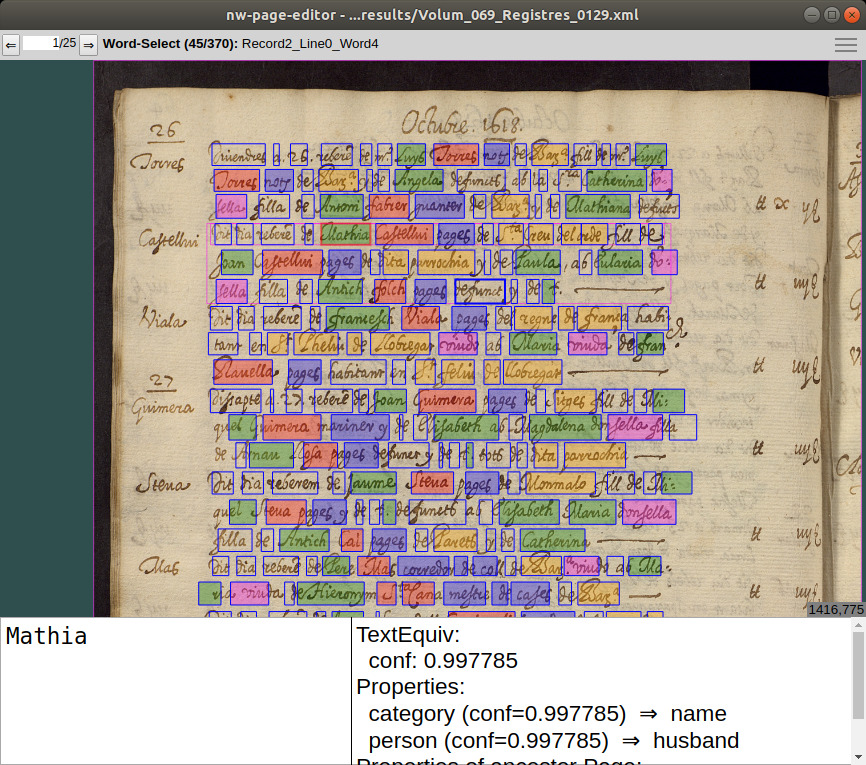
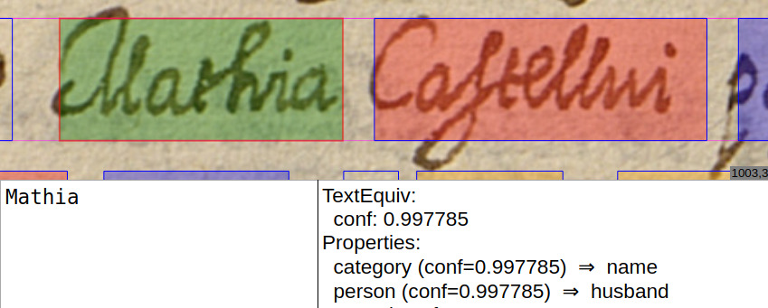

This repository includes the weights of the model and the corresponding
predictions on the test set for one of the results presented in the paper [Joint
Recognition of Handwritten Text and Named Entities with a Neural End-to-end
Model](https://arxiv.org/abs/1803.06252). The model and predictions correspond
to the result in the last row of Table III in the paper.

The model weights are provided both as a Torch 7 file
[model.t7](model/model.t7), which can be used with the original framework
[Laia](https://github.com/jpuigcerver/Laia) used in the experiments, and also
provided as a state dictionary [model.pth](model/model.pth) that could be used
in [pytorch](https://pytorch.org/tutorials/beginner/saving_loading_models.html).
The [symbols.txt](model/symbols.txt) file lists the characters and semantic
symbols for the model.

The test set prediction results are shared in [page xml
format](http://www.primaresearch.org/tools/PAGELibraries). They include the
recognized text, the predicted category and person for each word, and prediction
confidences. The words also include bounding boxes, though these are only a
crude approximation, which in general are not very accurate.

The original test set images and the xmls including the ground truth can be
obtained from the website of the [Information Extraction in Historical
Handwritten Records](https://rrc.cvc.uab.es/?ch=10) challenge. After downloading
the images, copy or symlink them to the [results/](results/) directory. Then you
can use for example [nw-page-editor](https://github.com/mauvilsa/nw-page-editor)
to visualize the predictions. Also included are two css files to visualize the
results highlighting with colors the different categories and persons. The
different ways to visualize the results are the following:

    nw-page-editor results/*.xml
    nw-page-editor --css viz/nw-page-editor-category.css results/*.xml
    nw-page-editor --css viz/nw-page-editor-person.css results/*.xml

Below are screenshots of an example visualization.


*Full window visualization*


*Zoomed in word visualization*

In the [code/](code/) directory you can a python scripts for converting the xmls
into structured json files. This script requires the
[pagexml](https://github.com/omni-us/pagexml/releases) library to work.

If you use any of the files in this repository please include a link to this
github project and cite the paper:

```
@inproceedings{Carbonell18_DAS,
  author    = {Manuel Carbonell and
               Mauricio Villegas and
               Alicia Forn\'es and
               Josep Llad\'os},
  title     = {Joint Recognition of Handwritten Text and Named Entities with a Neural End-to-end Model},
  booktitle = {13th {IAPR} Workshop on Document Analysis Systems, {DAS} 2018, Vienna,
               Austria, April 24-27, 2018},
  pages     = {399--404},
  year      = {2018},
  doi       = {10.1109/DAS.2018.52},
  isbn      = {978-1-5386-3346-5},
}
```
